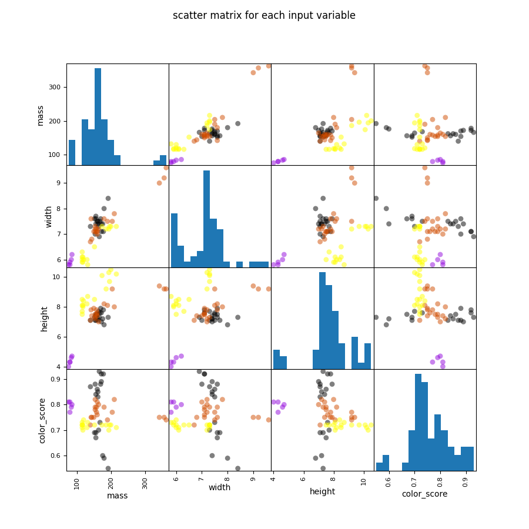

# Fruit Classification using Machine Learning

This project applies multiple Machine Learning algorithms to classify fruits based on their physical characteristics.

---

##  Dataset Overview

The dataset contains **59 samples** of different fruits with the following features:

- mass
- width
- height
- color_score

Target variable:
- fruit_label (Apple, Mandarin, Orange, Lemon)

Dataset shape:
(59, 7)

---

##  Data Visualization

A scatter matrix was generated to explore relationships between features.



---

##  Machine Learning Models Used

The following models were implemented and compared:

1. Logistic Regression  
2. Decision Tree Classifier  
3. K-Nearest Neighbors (KNN)

---

##  Train/Test Split

- Train size: 80%  
- Test size: 20%  
- Random state: 0  
- Feature scaling: MinMaxScaler  

---

##  Model Performance

| Model | Train Accuracy | Test Accuracy |
|--------|---------------|--------------|
| Logistic Regression | 0.76 | 0.41 |
| Decision Tree | 1.00 | 0.91 |
| KNN | 0.97 | 1.00 |

---

##  Analysis

- Logistic Regression showed underfitting due to the small dataset and possible non-linear class boundaries.  
- Decision Tree achieved perfect training accuracy, indicating possible overfitting.  
- KNN achieved the best test accuracy (100%), likely due to the small dataset size.  

 Note: Since the dataset contains only 59 samples, results may not generalize well to larger datasets.

---

##  Technologies Used

- Python 3.12  
- NumPy  
- Pandas  
- Matplotlib  
- Scikit-learn  

---

##  Installation

Clone the repository:

```bash
git clone https://github.com/sagharmaktabkhah/fruit-classification-ml.git
cd fruit-classification-ml
```

Install dependencies:

```bash
pip install -r requirements.txt
```

---

##  Run the Project

```bash
python main.py
```

---

##  Future Improvements

- Add Cross Validation  
- Hyperparameter tuning (GridSearchCV)  
- Confusion Matrix visualization  
- Larger dataset testing  
- Model comparison plots  

---

##  Author

Sahar Maktabkhah  
Machine Learning Enthusiast
